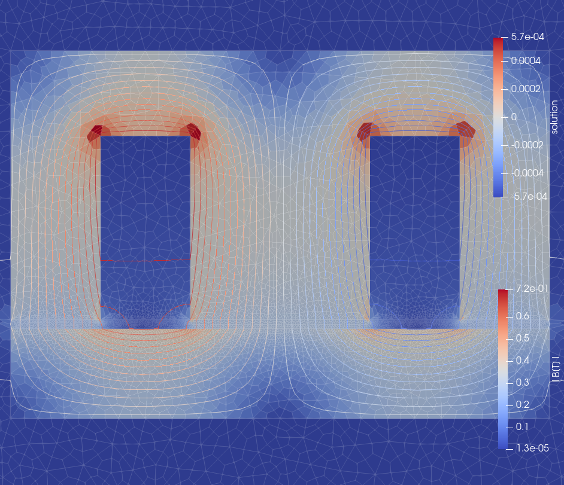

Magas
=====

Magas is an open source magnetostatic finite element solver solving

  

where:
A - Vector potential (3rd component), &nu; - Material reluctivity (reciprocal of permeability), J - Current density, **H**0 - Permanent magnet field strength.

It features:
- Linear and Non-linear (experimental) 2D solver.
- Mesh support: Gmsh.
- Material definition as a constant reluctivity or a CSV text file describing BH curve.
- VTU export for visualization with Paraview.
- JSON export for scalar results.
- User defined post processing Scalar and Field functions.
- Pre-made common postprocessors (Torque, Force, Flux linkage, Energy, Magnetic flux density (B), Magnetic field strength (H), Point evaluation, Lorentz Force, ...)
- Periodic and anti-periodic boundaries.
- Virtual mesh rotation (experimental).

Installation from sources:
--------------------------
If building from sources, make sure all the dependencies are installed. See the dependency list for more details.

Let's say you've unpacked the .tar.gz file into a directory /path/to/magas/sources. 
Then configure, compile, and install Magas with:

    mkdir build
    cd build
    cmake -DCMAKE_INSTALL_PREFIX=/path/where/magas/should/be/installed/to /path/to/magas/sources
    sudo make install    (alternatively $ make -j<N> install)
    make test

To build from the repository, execute the following commands first:

    git clone https://github.com/gsegon/Magas.git
    cd Magas

Then continue as before.

Installation from package managers (Ubuntu/Debian):
-----------------------------------

Add magas and dependecy repositories:

    sudo add-apt-repository ppa:ginggs/deal.ii-9.4.0-backports
    sudo add-apt-repository ppa:gsegon/magas
    sudo apt update

Install magas:

    sudo apt-get install magas

    

Run an example:
--------------

Before running an example:

    sudo chown -R $USER ~/magas
    

Run an example:

    cd ~/magas/examples/EI_core
    magas EI_core.json

After a successful run the output is:

    ::Initializing solver::
        Reading mesh...Done!
        Setting up maps...Done!
    ::Running solver::
        Setting up system...Done!
        Assembling system...Done!
        Solving system...       Solving: Done!
    ::Postprocessing results::
        Total magnetic energy [J] = 0.036475
        NUmber of cells = 16296
        I [A] = 67.65
    ::Export results::
        Output written to EI_core.vtu ("<full path to current working directory>/EI_core.vtu")
        Output written to results-EI_core.json ("<full path to current working directory>/results-EI_core.json")

Output file _results-EI_core.json_ contains results of user defined scalar postprocessor expressions:

    {
        "I [A]": 67.6499999999774,
        "NUmber of cells": 16296.0,
        "Total magnetic energy [J]": 0.036474959423895545
    }

Output file _EI_core.vtu_ contains visualization of the mesh, solution and results of user defined postprocessor expessions found in EI_core.json. Paraview may be used for visualization.

  

Dependency list:
----------------

The only dependecy that needs to be installed spearately from magas is [deal.ii](https://www.dealii.org/). Instruction on how to install deal.ii can be found on the it's website. 
Other dependencies are included with Magas source code and can be found in _external_ directory.

| Dependency                                      | Version  | Bundled |
|-------------------------------------------------|----------|---------|
| [deal.ii](https://github.com/dealii/dealii)     | >= 9.4.0 | No      |
| [json](https://github.com/nlohmann/json)        |          | Yes     |
| [cxxopts](https://github.com/jarro2783/cxxopts) |          | Yes     |
| [exprtk](https://github.com/ArashPartow/exprtk) |          | Yes     |
| [vtu11](https://github.com/phmkopp/vtu11)       |          | Yes     |
| [GSL](https://www.gnu.org/software/gsl/)        |          | No      |

## License

See LICENSE file.

